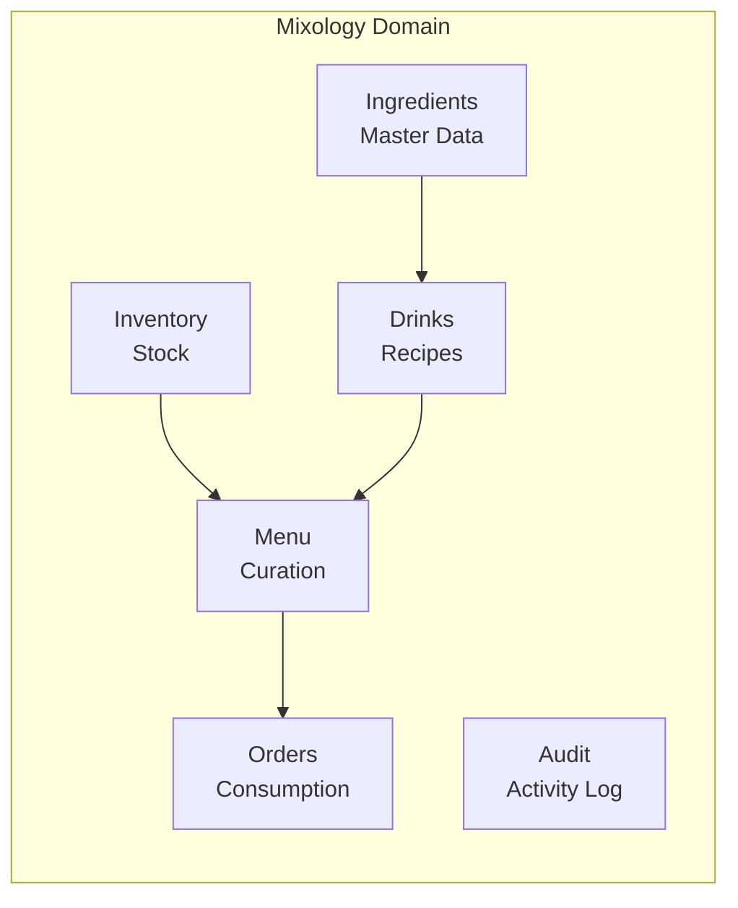
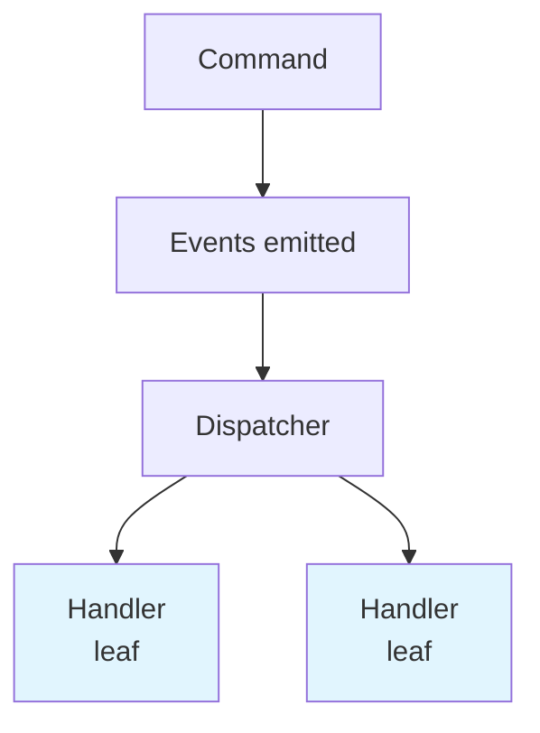
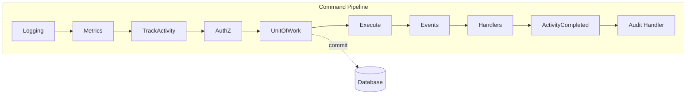
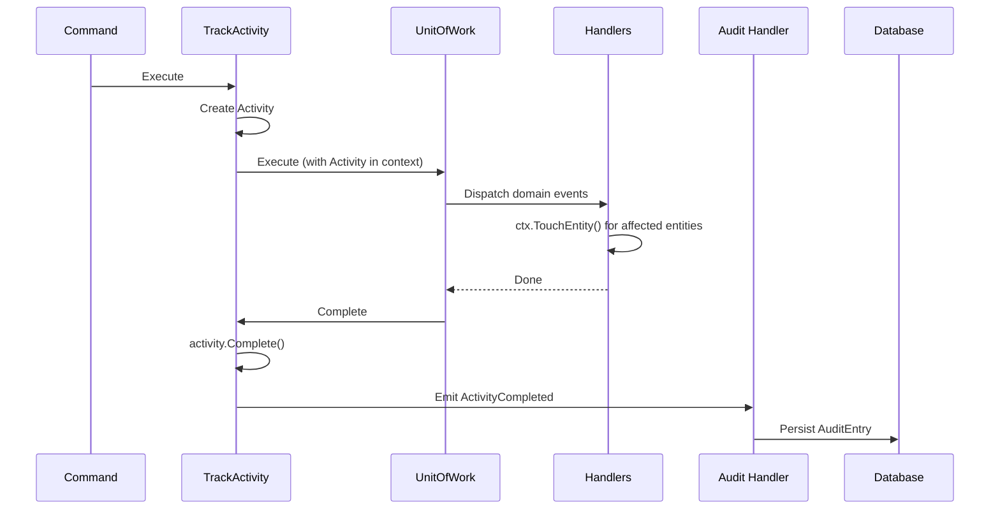

# Sprint 032b: README Mermaid Diagrams and Activity Documentation

## Goal

Update the README to use Mermaid diagrams (GitHub-native rendering) and document the middleware activity tracking and audit module.

## Status

- Started: 2026-01-13
- Completed: 2026-01-13

## Why Mermaid?

- GitHub renders Mermaid natively in markdown
- Easier to maintain than ASCII art
- Supports flowcharts, sequence diagrams, and more
- Consistent styling across diagrams

## Diagrams to Convert

### 1. Bounded Contexts Overview

**Current (ASCII):**
```
┌─────────────────────────────────────────────────────────────────────────────┐
│                           Mixology Domain                                   │
│  ┌─────────────┐     ┌─────────────┐     ┌─────────────┐     ┌───────────┐  │
│  │ Ingredients │────▶│   Drinks    │     │  Inventory  │────▶│   Menu    │  │
...
```

**New (Mermaid):**
~~~markdown

~~~

### 2. Event Flow (No Cascading)

**Current (ASCII):**
```
Command
    │
    ▼
Event(s) emitted
    │
    ▼
┌──────────┐
│Dispatcher│
...
```

**New (Mermaid):**
~~~markdown

~~~

### 3. Write Pipeline (Commands)

**Current (ASCII):**
```
┌──────────────────────────────────────────────────────────────────┐
│                     Write Pipeline (Commands)                    │
│  ┌─────────┐  ┌─────────┐  ┌─────────┐  ┌─────────┐  ┌─────────┐ │
│  │ Logging │→ │ Metrics │→ │  AuthZ  │→ │   UoW   │→ │ Execute │ │
...
```

**New (Mermaid):**
~~~markdown

~~~

## New Section: Activity Tracking & Audit

Add a new section documenting the activity tracking and audit module:

~~~markdown
## Activity Tracking & Audit

Every command execution is tracked as an **Activity** and persisted to the audit log.



### Activity Structure

```go
type Activity struct {
    Action    cedar.EntityUID   // e.g., Mixology::Drink::Action::"delete"
    Resource  cedar.EntityUID   // Primary resource
    Principal cedar.EntityUID   // Actor
    StartedAt time.Time
    CompletedAt time.Time
    Touches   []cedar.EntityUID // All affected entities
    Success   bool
    Error     string
}
```

### Touch Recording

Handlers call `ctx.TouchEntity(uid)` to record entities they affect:

```go
func (h *DrinkDeletedMenuUpdater) Handle(ctx *middleware.Context, e DrinkDeleted) error {
    for _, menu := range affectedMenus {
        // Update menu...
        ctx.TouchEntity(menu.ID)
    }
    return nil
}
```

### Audit Queries

```bash
# List recent audit entries
mixology audit list --limit 20

# Filter by principal
mixology audit list --principal owner

# Filter by entity
mixology audit list --entity Mixology::Drink::margarita

# View entity history
mixology audit history Mixology::Drink::margarita
```
~~~

## Updated Context Responsibilities Table

Add Audit to the table:

| Context | Owns | Queries From | Produces Events |
|---------|------|--------------|-----------------|
| **Audit** | Activity log, audit entries | - | - |

Note: Audit consumes `ActivityCompleted` from middleware but produces no domain events.

## Tasks

- [x] Convert Bounded Contexts diagram to Mermaid
- [x] Convert Event Flow diagram to Mermaid
- [x] Convert Write Pipeline diagram to Mermaid
- [x] Add Audit to Context Responsibilities table
- [x] Add "Activity Tracking & Audit" section with sequence diagram
- [x] Document `ctx.TouchEntity()` pattern
- [ ] Document audit CLI commands
- [ ] Update command chain code snippet to include `TrackActivity()`
- [ ] Verify diagrams render correctly on GitHub

## Acceptance Criteria

- [ ] All ASCII diagrams converted to Mermaid
- [ ] Mermaid diagrams render correctly in GitHub markdown preview
- [ ] Activity tracking and audit module documented
- [ ] Touch recording pattern documented with example
- [ ] Audit CLI commands documented
- [ ] Context Responsibilities table includes Audit
