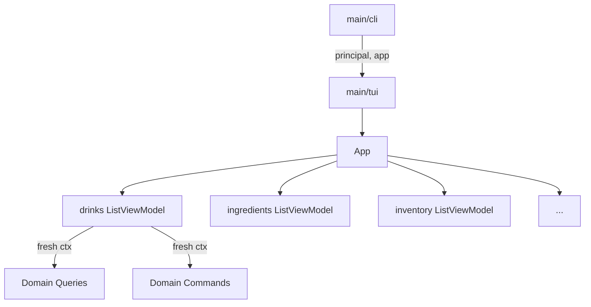
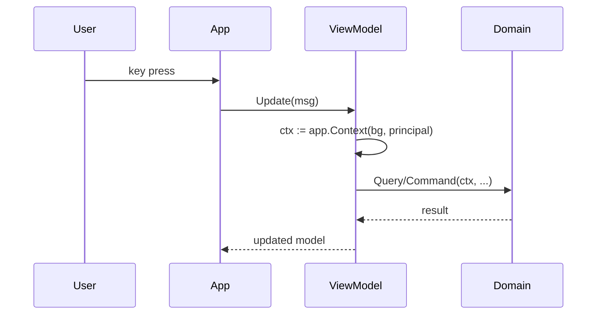

# Task 004: TUI Architecture README

## Goal

Create a README in `main/tui/` documenting the TUI architecture to help developers quickly understand the codebase.

## File to Create

`main/tui/README.md`

## Implementation

Create a README with:

1. **Brief overview** of the Bubble Tea TUI architecture
2. **Mermaid diagram** showing the component relationships
3. **Key concepts** (App, ViewModels, fresh context pattern)
4. **File organization** quick reference

### Suggested Content Structure

```markdown
# TUI Package

Brief description of the Bubble Tea-based terminal UI.

## Architecture

Mermaid diagram showing:
- App as root model
- ViewModels per domain
- Fresh context per command/query
- Package-level config (styles/keys)

## Key Concepts

### App
- Root Bubble Tea model
- Stores principal (not context)
- Manages view navigation and caching

### ViewModels
- One per domain view (drinks, ingredients, etc.)
- Import styles/keys from main/tui package
- Create fresh middleware.Context per operation

### Fresh Context Pattern
- Each command/query gets isolated context
- Matches CLI semantics
- Prevents state leakage between operations

## File Organization

Quick reference of key files and their purposes.

## Adding a New View

Brief guide for adding new domain views.
```

### Mermaid Diagram Ideas

**Component hierarchy:**


**Context flow:**


## Notes

- Keep it concise - developers should be able to skim it quickly
- Focus on the "why" of architectural decisions, not just "what"
- Mermaid diagrams render in GitHub/GitLab markdown
- Reference this README from the main project docs if applicable

## Checklist

- [x] Create `main/tui/README.md`
- [x] Include architecture overview
- [x] Add mermaid diagram(s)
- [x] Document key concepts (App, ViewModels, fresh context)
- [x] Add file organization reference
- [x] Brief guide for adding new views
- [ ] Verify mermaid renders correctly (test in GitHub preview)
