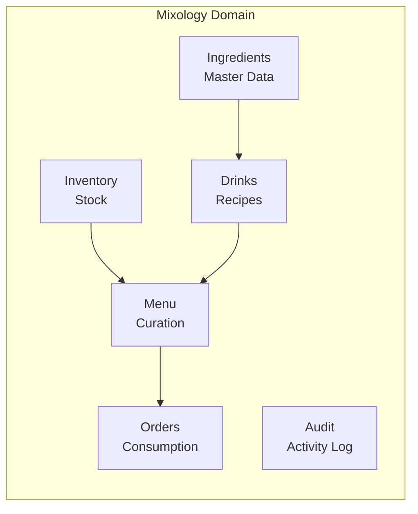
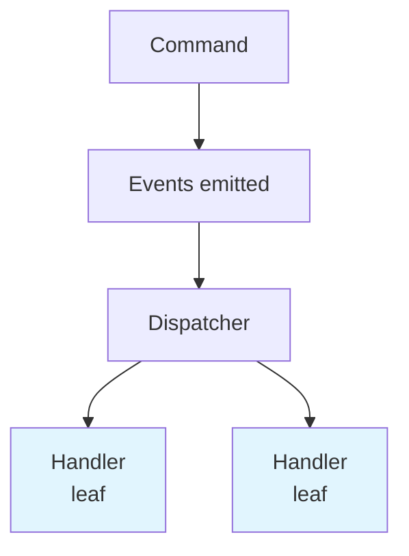
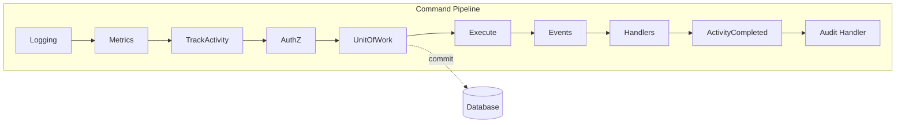
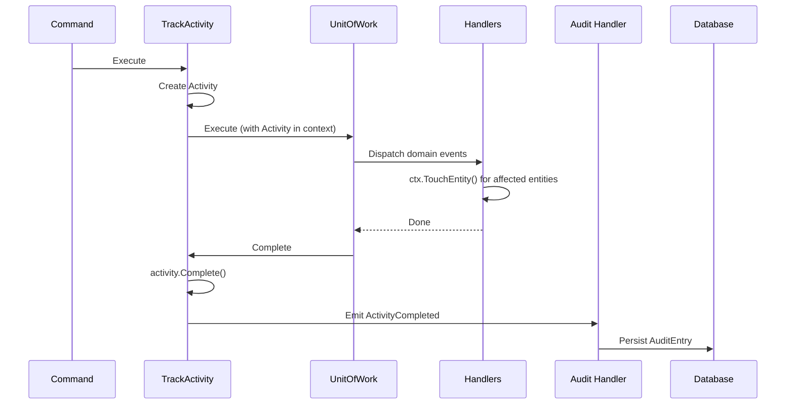

# Mixology Modular Monolith

A modular monolith sample that models a cocktail bar domain with explicit bounded contexts,
middleware pipelines, and event-driven coordination.

## Bounded Contexts Overview



## Event Flow (No Cascading)



## Write Pipeline (Commands)



## Context Responsibilities

| Context | Owns | Queries From | Produces Events |
|---------|------|--------------|-----------------|
| Ingredients | Ingredient catalog | - | IngredientCreated, IngredientUpdated, IngredientDeleted |
| Drinks | Drink recipes | Ingredients | DrinkCreated, DrinkUpdated, DrinkDeleted |
| Inventory | Stock levels | Ingredients | StockAdjusted |
| Menu | Published menus | Drinks, Inventory | MenuCreated, DrinkAddedToMenu, DrinkRemovedFromMenu, MenuPublished |
| Orders | Customer orders | Menu, Drinks, Inventory | OrderPlaced, OrderCompleted, OrderCancelled |
| Audit | Activity log, audit entries | - | - |

Note: Audit consumes `ActivityCompleted` from middleware but produces no domain events.

## Activity Tracking & Audit

Every command execution is tracked as an **Activity** and persisted to the audit log.



### Activity Structure

```go
type Activity struct {
    Action    cedar.EntityUID   // e.g., Mixology::Drink::Action::"delete"
    Resource  cedar.EntityUID   // Primary resource
    Principal cedar.EntityUID   // Actor
    StartedAt time.Time
    CompletedAt time.Time
    Touches   []cedar.EntityUID // All affected entities
    Success   bool
    Error     string
}
```

### Touch Recording

Handlers call `ctx.TouchEntity(uid)` to record entities they affect:

```go
func (h *DrinkDeletedMenuUpdater) Handle(ctx *middleware.Context, e DrinkDeleted) error {
    for _, menu := range affectedMenus {
        // Update menu...
        ctx.TouchEntity(menu.ID)
    }
    return nil
}
```

### Audit Queries

```bash
# List recent audit entries
mixology audit list --limit 20

# Filter by principal
mixology audit list --principal owner

# Filter by entity
mixology audit list --entity Mixology::Drink::margarita

# View entity history
mixology audit history Mixology::Drink::margarita
```
