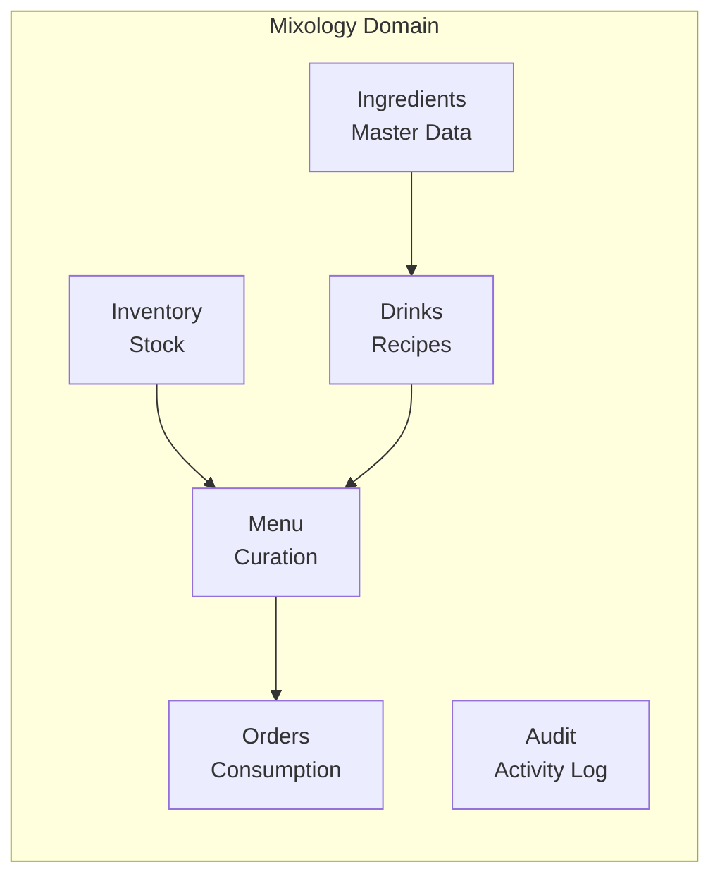
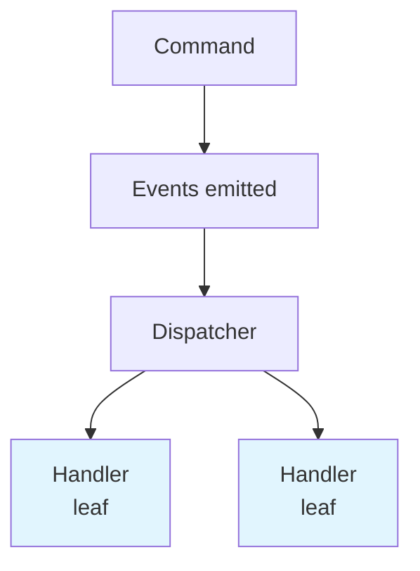
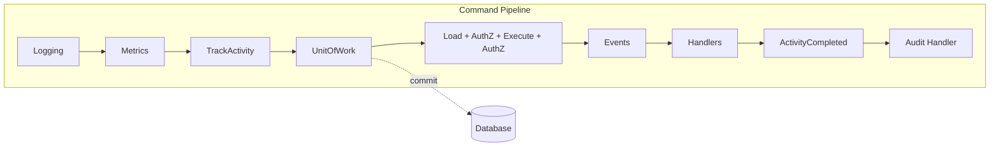
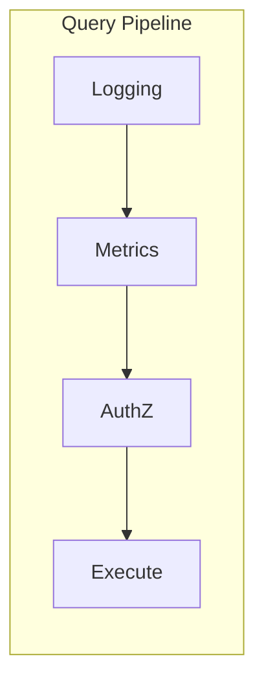

# Mixology Modular Monolith

A modular monolith sample that models a cocktail bar domain with explicit bounded contexts,
middleware pipelines, Cedar-based authorization, and event-driven coordination. It ships with
a CLI and a Bubble Tea TUI, both backed by an embedded bstore (bbolt) database.

## Development

### Prerequisites

- Go `1.25.5` or newer (see `go.mod`)
- No root `Makefile` or wrapper scripts are required; the repo uses plain `go` commands, and the lint tools are pinned in `go.mod` and run via `go tool`

### Common Local Workflow

```bash
# Regenerate generated code (dispatcher wiring, authz policies, entity IDs, error types)
go generate ./...

# Build
go build ./...

# Architecture boundaries
go tool arch-lint -config=.arch-lint.yaml

# Tests
go test ./...
```

### Run the App

The CLI binary is `mixology` (`main/cli`), and the TUI is launched through the same binary with
`--tui`. Both use `data/mixology.db` by default.

```bash
# Seed a local database with sample ingredients, drinks, inventory, and a published menu
go run ./main/seed

# CLI examples
go run ./main/cli ingredients list
go run ./main/cli menu list
go run ./main/cli audit list --limit 20

# Test authorization boundaries with different roles
go run ./main/cli --actor bartender menu list
go run ./main/cli --as anonymous drinks list

# Launch the TUI
go run ./main/cli --tui
```

Set `MIXOLOGY_DB=path/to/other.db` to override the database path used by `go run ./main/seed`.
The CLI hardcodes `data/mixology.db`.

### Run CI Checks Locally

```bash
go generate ./...
go build ./...
go tool arch-lint -config=.arch-lint.yaml
go tool go-check-sumtype ./...
go tool exhaustive ./...
go test ./...
```

## Project Layout

```
app/
  kernel/          Shared value types (entity IDs, money, measurement, currency, quality)
  domains/         One package per bounded context
    <ctx>/
      module.go        Public API (commands + queries)
      events/          Domain events (public contracts)
      models/          Read models
      queries/         Read-only query handlers
      handlers/        Cross-domain event handlers (not all domains have these)
      authz/           Cedar policy definitions for this context
      surfaces/
        cli/           urfave/cli command builders
        tui/           Bubble Tea view models
      internal/
        commands/      Write logic (not importable by other domains)
        dao/           bstore persistence
pkg/
  middleware/      Command & query pipelines (logging, metrics, authz, UoW, activity)
  authz/           Cedar policy engine integration
  authn/           Actor definitions (owner, manager, sommelier, bartender, anonymous)
  dispatcher/      Generated event -> handler routing
  store/           bstore wrapper with metrics & transactions
  telemetry/       Prometheus metrics
  log/             Structured slog logging
  errors/          Typed domain errors with mapped exit codes & TUI styles
  optional/        Generic Value[T] optional type (Some/None/Map/FlatMap)
  tui/             Shared Bubble Tea components (forms, dialogs, styles, keys)
  testutil/        Fixtures, bootstrap helpers, assertion utilities
main/
  cli/             CLI + TUI entry point (--tui flag launches the TUI)
  seed/            Database seeder
```

## Bounded Contexts Overview


```mermaid
graph LR
    subgraph Mixology Domain
        Ingredients[Ingredients<br/>Master Data]
        Drinks[Drinks<br/>Recipes]
        Inventory[Inventory<br/>Stock]
        Menu[Menu<br/>Curation]
        Orders[Orders<br/>Consumption]
        Audit[Audit<br/>Activity Log]

        Ingredients --> Drinks
        Inventory --> Menu
        Drinks --> Menu
        Menu --> Orders
    end
```

## Event Flow (No Cascading)

Handlers receive `*middleware.HandlerContext` instead of the full `*middleware.Context`.
`HandlerContext` deliberately omits `AddEvent()`, so handlers **cannot emit new events at
compile time** — this is how the no-cascading invariant is enforced.


```mermaid
flowchart TD
    C[Command] --> E[Events emitted]
    E --> D[Dispatcher]
    D --> H1[Handler<br/>leaf]
    D --> H2[Handler<br/>leaf]

    style H1 fill:#e1f5fe
    style H2 fill:#e1f5fe
```

When multiple handlers subscribe to the same event, the dispatcher supports a two-phase
protocol. Handlers implementing the `PreparingHandler` interface define a `Handling()` method
that is called for **all** handlers before any `Handle()` runs. This lets handlers query
affected entities before mutations begin — used, for example, when `IngredientDeleted` is
handled by both the Drinks and Menus domains.

## Middleware Pipelines

### Write Pipeline (Commands)

The command chain is: Logging, Metrics, TrackActivity, UnitOfWork, DispatchEvents. Authorization
is **not** a separate middleware step — it happens inline inside `RunCommand`, which authorizes
twice: once on the loaded input entity and once on the output entity. This dual check lets
policies consider both the pre-mutation state (e.g., "can this user modify a Draft menu?") and
the post-mutation result (e.g., "is the resulting entity in a state this user can create?").

Both the input and output types must satisfy the `CedarEntity` interface, which requires them to
represent themselves as Cedar entities for policy evaluation.


```mermaid
flowchart LR
    subgraph Command Pipeline
        L[Logging] --> M[Metrics]
        M --> A[TrackActivity]
        A --> U[UnitOfWork]
        U --> E[Load + AuthZ + Execute + AuthZ]
        E --> EV[Events]
        EV --> H[Handlers]
        H --> AC[ActivityCompleted]
        AC --> AU[Audit Handler]
    end

    U -.->|commit| DB[(Database)]
```

### Read Pipelines (Queries)

There are two query pipelines. `QueryChain` checks action-level permission (e.g., "can this
principal list drinks?"). `QueryWithResourceChain` additionally passes a `cedar.Entity` for
resource-scoped authorization (e.g., "can this principal view this specific menu?").


```mermaid
flowchart LR
    subgraph Query Pipeline
        L[Logging] --> M[Metrics]
        M --> Z[AuthZ]
        Z --> E[Execute]
    end
```

## Authorization

Authorization uses [Cedar](https://www.cedarpolicy.com/) for RBAC policy evaluation. Each domain
defines its own Cedar policies (in `<domain>/authz/`), and generated Go code assembles them
into a single `PolicySet` at startup.

**Roles** (defined in `pkg/authn`):

| Actor | Access |
|-------|--------|
| owner | Full access to all domains |
| manager | Operational commands (menus, inventory, orders) |
| sommelier | Drinks, menus, ingredients |
| bartender | Orders and read-only views |
| anonymous | Read-only queries only |

Queries pass through AuthZ middleware. Commands authorize inline via `RunCommand` (see above).
Denied requests return a typed permission error.

## Context Responsibilities

| Context | Owns | Queries From | Produces Events |
|---------|------|--------------|-----------------|
| Ingredients | Ingredient catalog | - | IngredientCreated, IngredientUpdated, IngredientDeleted |
| Drinks | Drink recipes | Ingredients | DrinkCreated, DrinkUpdated, DrinkDeleted |
| Inventory | Stock levels | Ingredients | StockAdjusted |
| Menu | Published menus | Drinks, Inventory | MenuCreated, DrinkAddedToMenu, DrinkRemovedFromMenu, MenuPublished, MenuDrafted |
| Orders | Customer orders | Menu, Drinks, Inventory | OrderPlaced, OrderCompleted, OrderCancelled |
| Audit | Activity log, audit entries | - | - |

Note: Audit consumes `ActivityCompleted` from middleware but produces no domain events.

## Code Generation

Four `go:generate` programs follow the same pattern: a `gen/` subdirectory with a Go program
invoked by `//go:generate go run ./gen` in the parent package.

| Generator | Scans | Produces |
|-----------|-------|----------|
| `pkg/dispatcher/gen` | `*/events/*.go` for event structs, `*/handlers/*.go` for handler methods (AST) | `dispatcher_gen.go` — type-switch `Dispatch()` wiring all event-to-handler relationships |
| `pkg/authz/gen` | `*/authz/` directories for embedded `.cedar` policy files | `policies_gen.go` — assembles all domain policies into a single `PolicySet` |
| `app/kernel/entity/gen` | `Entities` slice in `entities.go` | Strongly-typed IDs (`DrinkID`, `MenuID`, etc.) with parse/validate/format methods |
| `pkg/errors/gen` | `ErrorKinds` slice in `errors.go` | Per-kind error constructors (`Invalidf`, `NotFoundf`, etc.) and matching `testutil` assertion helpers |

## Architecture Enforcement

Seven `arch-lint` rules (`.arch-lint.yaml`) enforce module boundaries at CI time:

| Rule | Prevents |
|------|----------|
| shared-no-domains | Shared app packages importing domain code |
| no-cross-domain-internal | Domain A reaching into Domain B's internals |
| handlers-no-commands | Event handlers importing command implementations |
| events-no-internal | Event packages depending on internal packages |
| queries-no-commands | Queries importing write-side code |
| models-no-internal | Domain models depending on internal packages |
| handlers-no-modules | Handlers accessing module roots (must use queries/events/models) |

Additional compile-time guarantees: `go-check-sumtype` enforces exhaustive pattern matching on
sum types, and `exhaustive` ensures all enum switches are complete.

## Cross-Transport Error Types

Each `ErrorKind` in `pkg/errors` maps a single error category to HTTP status code, gRPC code,
CLI exit code, and TUI display style simultaneously. The error generator produces both the
`pkg/errors` types (with `Invalidf()`, `NotFoundf()`, `Permissionf()`, etc.) and matching
`pkg/testutil` assertion helpers (`AssertNotFound`, `AssertPermission`, etc.). This keeps the
domain surface-agnostic — commands return domain errors that each surface renders appropriately.

## Terminal UI

The TUI (`go run ./main/cli --tui`) provides a Bubble Tea interface for all six domains.

Each domain surface ships list, detail, create, and edit view models. The TUI runs queries and
commands through the same middleware pipelines as the CLI, so authorization, logging, metrics,
and audit tracking all apply identically. Forms include validation, and destructive actions
(delete, draft) use confirmation dialogs with danger styling.

## Activity Tracking & Audit

Every command execution is tracked as an **Activity** and persisted to the audit log.


```mermaid
sequenceDiagram
    participant C as Command
    participant TA as TrackActivity
    participant UoW as UnitOfWork
    participant H as Handlers
    participant AH as Audit Handler
    participant DB as Database

    C->>TA: Execute
    TA->>TA: Create Activity
    TA->>UoW: Execute (with Activity in context)
    UoW->>H: Dispatch domain events
    H->>H: ctx.TouchEntity() for affected entities
    H-->>UoW: Done
    UoW->>TA: Complete
    TA->>TA: activity.Complete()
    TA->>AH: Emit ActivityCompleted
    AH->>DB: Persist AuditEntry
```

### Touch Recording

Handlers call `ctx.TouchEntity(uid)` to record entities they affect:

```go
func (h *DrinkDeleted) Handle(ctx *middleware.HandlerContext, e drinksevents.DrinkDeleted) error {
    menus, err := h.dao.ListByDrink(ctx, e.Drink.ID)
    if err != nil {
        return err
    }
    for _, menu := range menus {
        // Remove deleted drink from menu items...
        if err := h.dao.Update(ctx, *menu); err != nil {
            return err
        }
        ctx.TouchEntity(menu.ID.EntityUID())
    }
    return nil
}
```

### Audit Queries

```bash
# List recent audit entries
mixology audit list --limit 20

# Filter by principal
mixology audit list --principal owner

# Filter by entity
mixology audit list --entity Mixology::Drink::drk-abc123

# View entity history
mixology audit history Mixology::Drink::drk-abc123
```

## CLI Usage Notes

- IDs are typed and must include the entity prefix: drinks use `drk-`, ingredients `ing-`, menus `mnu-`, orders `ord-` (inventory IDs are derived as `inv-<ingredient-id>` and audit entries use `aud-`).
- Commands that accept IDs use `--id` for the command's primary entity and `--<entity>-id` for cross-entity references (for example, `--menu-id`, `--drink-id`, `--ingredient-id`). Malformed IDs return an "invalid <entity> id prefix" error with exit code 10.

```bash
mixology drinks get --id drk-abc123
mixology ingredients get --id ing-abc123
mixology menu show --id mnu-abc123
mixology menu add-drink --menu-id mnu-abc123 --drink-id drk-abc123
mixology order place --menu-id mnu-abc123 drk-abc123:2 drk-xyz789:1
mixology inventory adjust --ingredient-id ing-abc123 --delta -0.5 --reason used
```
