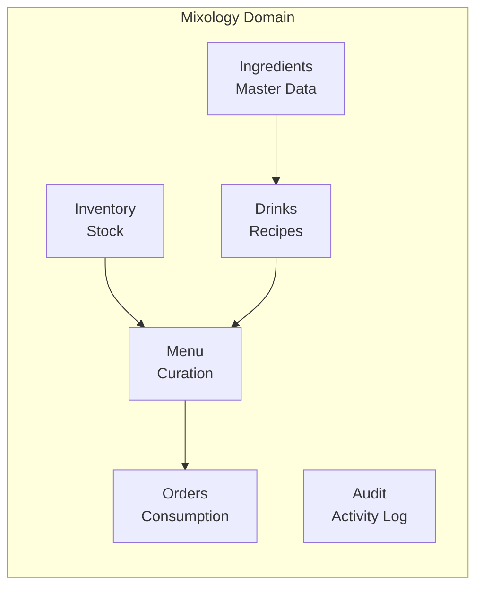
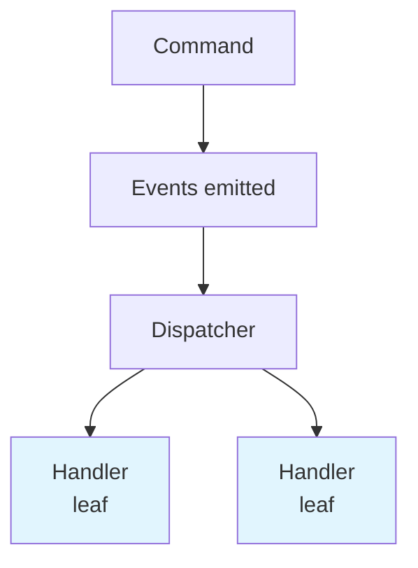
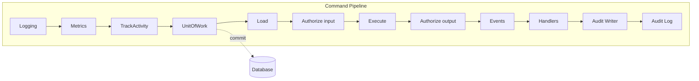
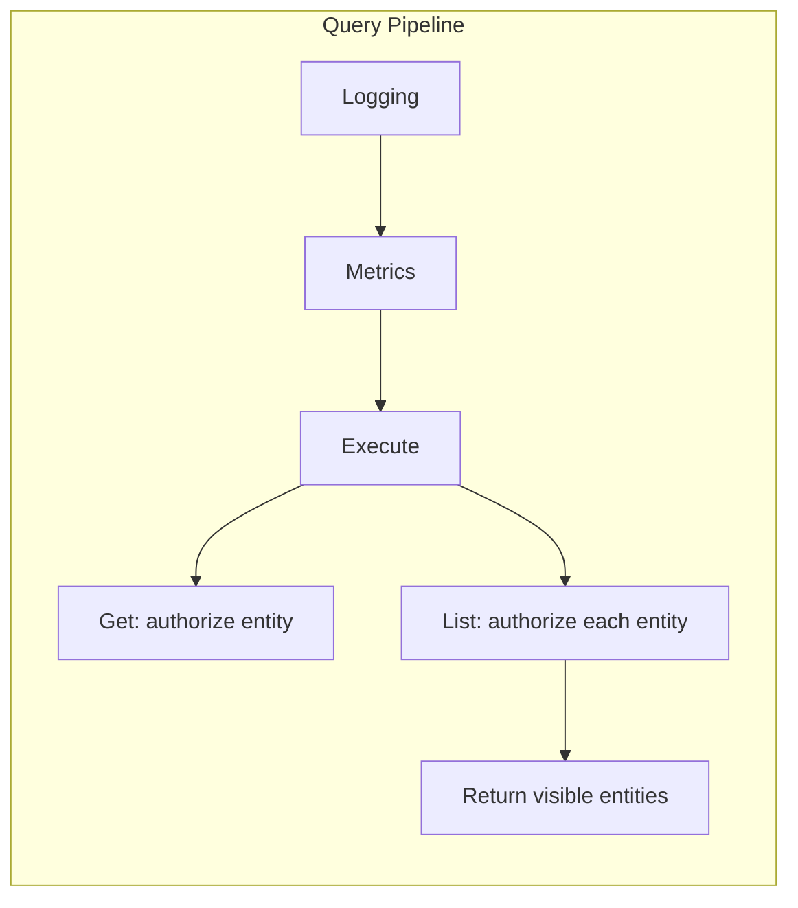
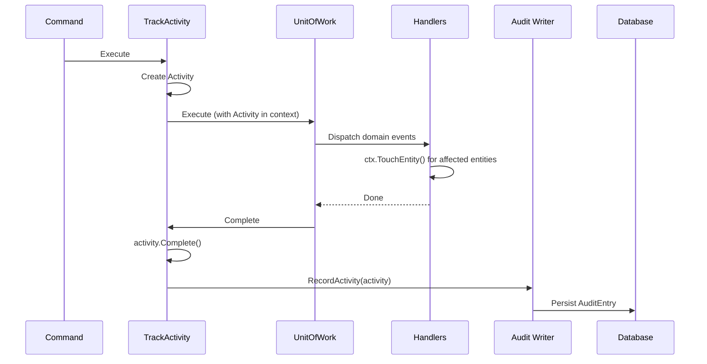

# Mixology Modular Monolith

[](https://github.com/TheFellow/go-modular-monolith/actions/workflows/ci.yml)

A modular monolith sample that models a cocktail bar domain with explicit bounded contexts,
middleware pipelines, Cedar-based authorization, and event-driven coordination. It ships with
a CLI and a Bubble Tea TUI, both backed by an embedded bstore (bbolt) database.

For a guided architectural walkthrough, see the [tutorial series](docs/mixology-onboarding.md).

## Development

### Prerequisites

- Go `1.26.5` or newer (see `go.mod`)
- No root `Makefile` or wrapper scripts are required; the repo uses plain `go` commands, `arch-lint` runs via `go tool`, and Go linting runs through the pinned `golangci-lint` command shown below.

### Common Local Workflow

```bash
# Regenerate generated code (dispatcher wiring, authz policies, entity IDs, error types)
go generate ./...

# Build
go build ./...

# Architecture boundaries
go tool arch-lint -config=.arch-lint.yaml

# Tests
go test ./...
```

### Run the App

The CLI binary is `mixology` (`main/cli`), and the TUI is launched through the same binary with
`--tui`. Both use `data/mixology.db` by default.

```bash
# Seed a local database with sample ingredients, drinks, inventory, and a published menu
go run ./main/seed

# CLI examples
go run ./main/cli ingredients list
go run ./main/cli menu list
go run ./main/cli audit list --limit 20

# Test authorization boundaries with different roles
go run ./main/cli --actor bartender menu list
go run ./main/cli --as anonymous drinks list

# Launch the TUI
go run ./main/cli --tui
```

Set `MIXOLOGY_DB=path/to/other.db` to override the database path used by `go run ./main/seed`.
The CLI hardcodes `data/mixology.db`.

### Run CI Checks Locally

```bash
go generate ./...
go build ./...
go tool arch-lint -config=.arch-lint.yaml
go run github.com/golangci/golangci-lint/v2/cmd/golangci-lint@v2.12.2 run
go test ./...
```

## Project Layout

```
app/
  kernel/          Shared value types (entity IDs, money, measurement, currency, quality)
  domains/         One package per bounded context
    <ctx>/
      module.go        Public API (commands + queries)
      events/          Domain events (public contracts)
      models/          Read models
      queries/         Read-only query handlers
      handlers/        Cross-domain event handlers (not all domains have these)
      authz/           Cedar policy definitions for this context
      surfaces/
        cli/           urfave/cli command builders
        tui/           Bubble Tea view models
      internal/
        commands/      Write logic (not importable by other domains)
        dao/           bstore persistence
pkg/
  middleware/      Operation pipelines (logging, metrics, authz, UoW, activity)
  authz/           Cedar policy engine integration
  authn/           Actor definitions (owner, manager, sommelier, bartender, anonymous)
  dispatcher/      Generated event -> handler routing
  store/           bstore wrapper with metrics & transactions
  telemetry/       Prometheus metrics
  log/             Structured slog logging
  errors/          Typed domain errors with mapped exit codes & TUI styles
  optional/        Minimal generic Value[T] optional type (Some/None/IsSome/Unwrap)
  tui/             Shared Bubble Tea components (forms, dialogs, styles, keys)
  testutil/        Fixtures, bootstrap helpers, assertion utilities
main/
  cli/             CLI + TUI entry point (--tui flag launches the TUI)
  seed/            Database seeder
```

The store is a required app-bootstrap dependency. As each bounded context is constructed, it
registers its own internal bstore model with that store. Persistence types stay behind their
domain boundary, invalid registration panics immediately as a programming error, and importing a
package has no database-registration side effects.

Entry points configure logging, metrics, and the authenticated principal on a `context.Context`,
then construct the application with `app.New(ctx, app.Config{Store: s})`. The application does not
retain request context or identity. CLI calls create a middleware context from the current request;
the TUI uses an explicit `app.Session` to bind its persistent login to the application.

## Bounded Contexts Overview


```mermaid
graph LR
    subgraph Mixology Domain
        Ingredients[Ingredients<br/>Master Data]
        Drinks[Drinks<br/>Recipes]
        Inventory[Inventory<br/>Stock]
        Menu[Menu<br/>Curation]
        Orders[Orders<br/>Consumption]
        Audit[Audit<br/>Activity Log]

        Ingredients --> Drinks
        Inventory --> Menu
        Drinks --> Menu
        Menu --> Orders
    end
```

## Event Flow (No Cascading)

Handlers receive `*middleware.HandlerContext` instead of the full `*middleware.Context`.
`HandlerContext` deliberately omits `AddEvent()`, so handlers **cannot emit new events at
compile time** — this is how the no-cascading invariant is enforced. Handlers can still
read and mutate state within their own domain; the restriction is on event emission, not
all writes.


```mermaid
flowchart TD
    C[Command] --> E[Events emitted]
    E --> D[Dispatcher]
    D --> H1[Handler<br/>leaf]
    D --> H2[Handler<br/>leaf]

    style H1 fill:#e1f5fe
    style H2 fill:#e1f5fe
```

When multiple handlers subscribe to the same event, the dispatcher supports a two-phase
protocol. Handlers implementing the `PreparingHandler` interface define a `Handling()` method
that is called for **all** handlers before any `Handle()` runs. Handlers are intentionally
constructed fresh for each event dispatch, so `Handling()` may query and store event-local
state on the handler receiver for the later `Handle()` call. This lets handlers inspect
affected entities before mutations begin — used, for example, when `IngredientDeleted` is
handled by both the Drinks and Menus domains.

## Middleware Pipelines

### Write Pipeline (Commands)

Commands use the shared operation pipeline with Logging, Metrics, TrackActivity, UnitOfWork,
and DispatchEvents. After `RunCommand` loads the current entity inside the unit of work, the
typed `AuthorizeCommand` middleware authorizes the loaded state, calls the handler, and then
authorizes the resulting state. This dual check lets policies consider both the pre-mutation
state (e.g., "can this user modify a Draft menu?") and the post-mutation result (e.g., "is the
resulting entity in a state this user can create?").

Both the input and output types must satisfy the `CedarEntity` interface, which requires them to
represent themselves as Cedar entities for policy evaluation.


```mermaid
flowchart LR
    subgraph Command Pipeline
        L[Logging] --> M[Metrics]
        M --> A[TrackActivity]
        A --> U[UnitOfWork]
        U --> LD[Load]
        LD --> AI[Authorize input]
        AI --> E[Execute]
        E --> AO[Authorize output]
        AO --> EV[Events]
        EV --> H[Handlers]
        H --> R[Audit Writer]
        R --> AU[Audit Log]
    end

    U -.->|commit| DB[(Database)]
```

### Read Pipelines (Queries)

Queries share the Logging and Metrics pipeline, then use a result-aware authorization wrapper.
`RunEntityQuery` loads one entity and authorizes its `CedarEntity` before returning it. Lookup
errors, including not found, are returned unchanged because there is no entity to authorize.
`RunListQuery` loads candidate entities, authorizes each one, and silently elides permission
denials; authorization evaluation and infrastructure errors still fail the query. Counts are
derived from the filtered list so they cannot reveal hidden entities.


```mermaid
flowchart LR
    subgraph Query Pipeline
        L[Logging] --> M[Metrics]
        M --> E[Execute]
        E --> G[Get: authorize entity]
        E --> LS[List: authorize each entity]
        LS --> F[Return visible entities]
    end
```

## Authorization

Authorization uses [Cedar](https://www.cedarpolicy.com/) for RBAC policy evaluation. Each domain
defines its own Cedar policies (in `<domain>/authz/`), and generated Go code assembles them
into a single `PolicySet` at startup.

**Roles** (defined in `pkg/authn`):

| Actor | Access |
|-------|--------|
| owner | Full access to all domains |
| manager | Operational commands and full catalog visibility |
| sommelier | Wine drinks plus permitted menu and ingredient operations |
| bartender | Non-wine drinks, orders, and permitted read-only views |
| anonymous | Public read-only views |

Gets and commands return a typed permission error when their entity is denied. Lists treat
denied entities as normal filtering and return only the visible subset.

## Context Responsibilities

| Context | Owns | Queries From | Produces Events |
|---------|------|--------------|-----------------|
| Ingredients | Ingredient catalog | - | IngredientCreated, IngredientUpdated, IngredientDeleted |
| Drinks | Drink recipes | Ingredients | DrinkCreated, DrinkUpdated, DrinkDeleted |
| Inventory | Stock levels | Ingredients | StockAdjusted |
| Menu | Published menus | Drinks, Inventory | MenuCreated, DrinkAddedToMenu, DrinkRemovedFromMenu, MenuPublished, MenuDrafted |
| Orders | Customer orders | Menu, Drinks, Inventory | OrderPlaced, OrderCompleted, OrderCancelled |
| Audit | Activity log, audit entries | - | - |

## Code Generation

Four `go:generate` programs follow the same pattern: a `gen/` subdirectory with a Go program
invoked by `//go:generate go run ./gen` in the parent package.

| Generator | Scans | Produces |
|-----------|-------|----------|
| `pkg/dispatcher/gen` | `*/events/*.go` for event structs, `*/handlers/*.go` for handler methods (AST) | `dispatcher_gen.go` — type-switch `Dispatch()` wiring all event-to-handler relationships |
| `pkg/authz/gen` | `*/authz/` directories for embedded `.cedar` policy files | `policies_gen.go` — assembles all domain policies into a single `PolicySet` |
| `app/kernel/entity/gen` | `Entities` slice in `entities.go` | Strongly-typed IDs (`DrinkID`, `MenuID`, etc.) with parse/validate/format methods |
| `pkg/errors/gen` | `AllKinds()` taxonomy in `kind.go` | Per-kind error constructors (`Invalidf`, `NotFoundf`, etc.) and matching `testutil` assertion helpers |

## Architecture Enforcement

Seven `arch-lint` rules (`.arch-lint.yaml`) enforce module boundaries at CI time:

| Rule | Prevents |
|------|----------|
| shared-no-domains | Shared app packages importing domain code |
| no-cross-domain-internal | Domain A reaching into Domain B's internals |
| handlers-no-commands | Event handlers importing command implementations |
| events-no-internal | Event packages depending on internal packages |
| queries-no-commands | Queries importing write-side code |
| models-no-internal | Domain models depending on internal packages |
| handlers-no-modules | Handlers accessing module roots (must use queries/events/models) |

Additional compile-time guarantees: `golangci-lint` runs its standard checks plus wrapped-error,
enum exhaustiveness, modernization, and project style checks, while `arch-lint` enforces module
boundaries.

## Cross-Transport Error Types

Each immutable `Kind` specification in `pkg/errors` maps one error category to an HTTP status,
gRPC code, CLI exit code, and TUI display style. Generated typed wrappers share a common error
payload that separates diagnostic detail from presentation-safe text. The generator also creates
matching `pkg/testutil` assertion helpers (`ErrorIsNotFound`, `ErrorIsPermission`, etc.). This
keeps the domain surface-agnostic while preventing internal errors from leaking through a user
surface.

## Terminal UI

The TUI (`go run ./main/cli --tui`) provides a Bubble Tea interface for all six domains.

Every domain surface supports list/detail navigation, with write workflows where the domain
has useful TUI operations: drinks and ingredients support create/edit/delete, inventory supports
adjust/set, menus support create/rename/delete/publish/draft, and orders support complete/cancel.
The TUI runs queries and commands through the same middleware pipelines as the CLI, so
authorization, logging, metrics, and write-command audit tracking apply consistently across
surfaces. Forms include validation, and destructive or state-changing actions use confirmation
dialogs with danger styling.

## Activity Tracking & Audit

Every write command executed through `RunCommand` is tracked as an **Activity** and persisted to
the audit log through an explicit audit writer callback. Domain events continue through the
dispatcher; audit activity recording is separate from that event flow. Audit reads remain on the
public audit module, while the writer is private to application bootstrap.


```mermaid
sequenceDiagram
    participant C as Command
    participant TA as TrackActivity
    participant UoW as UnitOfWork
    participant H as Handlers
    participant AR as Audit Writer
    participant DB as Database

    C->>TA: Execute
    TA->>TA: Create Activity
    TA->>UoW: Execute (with Activity in context)
    UoW->>H: Dispatch domain events
    H->>H: ctx.TouchEntity() for affected entities
    H-->>UoW: Done
    UoW->>TA: Complete
    TA->>TA: activity.Complete()
    TA->>AR: RecordActivity(activity)
    AR->>DB: Persist AuditEntry
```

### Touch Recording

Handlers call `ctx.TouchEntity(uid)` to record entities they affect:

```go
func (h *DrinkDeleted) Handle(ctx *middleware.HandlerContext, e drinksevents.DrinkDeleted) error {
    menus, err := h.dao.ListByDrink(ctx, e.Drink.ID)
    if err != nil {
        return err
    }
    for _, menu := range menus {
        // Remove deleted drink from menu items...
        if err := h.dao.Update(ctx, *menu); err != nil {
            return err
        }
        ctx.TouchEntity(menu.ID.EntityUID())
    }
    return nil
}
```

### Audit Queries

```bash
# List recent audit entries
mixology audit list --limit 20

# Filter by principal
mixology audit list --principal owner

# Filter by entity
mixology audit list --entity Mixology::Drink::drk-abc123

# View entity history
mixology audit history Mixology::Drink::drk-abc123
```

## CLI Usage Notes

- IDs are typed and must include the entity prefix: drinks use `drk-`, ingredients `ing-`, menus `mnu-`, orders `ord-` (inventory IDs are derived as `inv-<ingredient-id>` and audit entries use `aud-`).
- Commands that accept IDs use `--id` for the command's primary entity and `--<entity>-id` for cross-entity references (for example, `--menu-id`, `--drink-id`, `--ingredient-id`). Malformed IDs return an "invalid <entity> id prefix" error with exit code 10.

```bash
mixology drinks get --id drk-abc123
mixology ingredients get --id ing-abc123
mixology menu show --id mnu-abc123
mixology menu add-drink --menu-id mnu-abc123 --drink-id drk-abc123
mixology order place --menu-id mnu-abc123 drk-abc123:2 drk-xyz789:1
mixology inventory adjust --ingredient-id ing-abc123 --delta -0.5 --reason used
```
