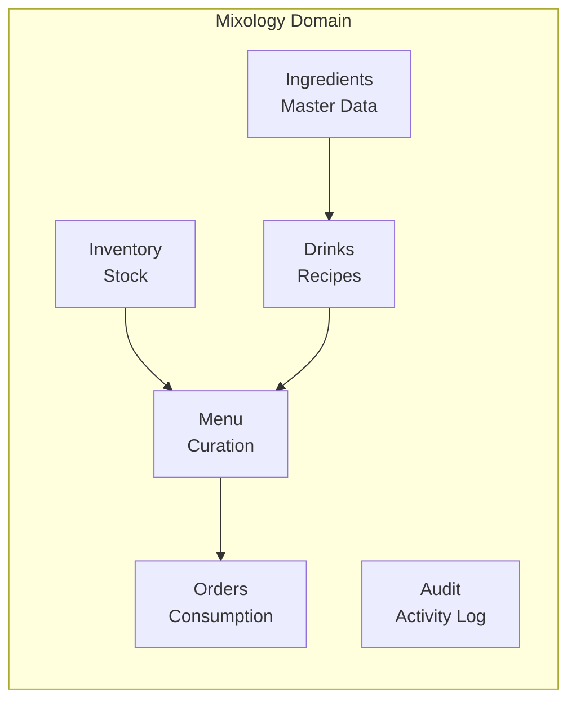
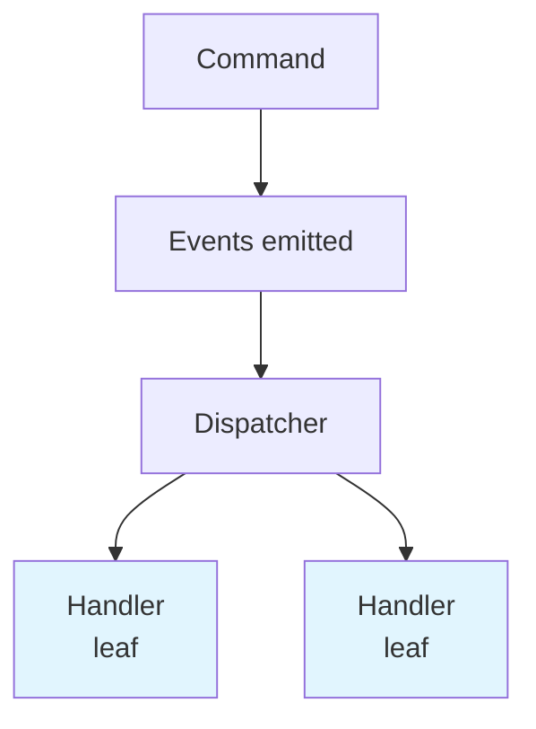
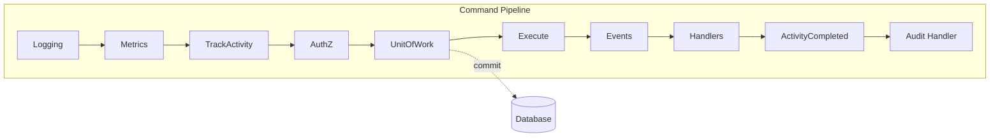

# Mixology Modular Monolith

A modular monolith sample that models a cocktail bar domain with explicit bounded contexts,
middleware pipelines, and event-driven coordination.

## Development

### Prerequisites

- Go `1.25.5` or newer (see `go.mod`)
- No root `Makefile` or wrapper scripts are required; the repo uses plain `go` commands, and the lint tools are pinned in `go.mod` and run via `go tool`

### Common Local Workflow

```bash
# Regenerate generated code
go generate ./...

# Build
go build ./...

# Architecture boundaries
go tool arch-lint -config=.arch-lint.yaml

# Tests
go test ./...
```

### Run the App

The CLI binary is `mixology` (`main/cli`), and the TUI is launched through the same binary with
`--tui`. Both use `data/mixology.db` by default.

```bash
# Seed a local database with sample ingredients, drinks, inventory, and a published menu
go run ./main/seed

# CLI examples
go run ./main/cli ingredients list
go run ./main/cli menu list
go run ./main/cli audit list --limit 20

# Test authorization boundaries with different roles
go run ./main/cli --actor bartender menu list
go run ./main/cli --as anonymous drinks list

# Launch the TUI
go run ./main/cli --tui
```

Set `MIXOLOGY_DB=path/to/other.db` to override the seed database path.

### Run CI Checks Locally

```bash
go generate ./...
go build ./...
go tool arch-lint -config=.arch-lint.yaml
go tool go-check-sumtype ./...
go tool exhaustive ./...
go test ./...
```

## Bounded Contexts Overview


```mermaid
graph LR
    subgraph Mixology Domain
        Ingredients[Ingredients<br/>Master Data]
        Drinks[Drinks<br/>Recipes]
        Inventory[Inventory<br/>Stock]
        Menu[Menu<br/>Curation]
        Orders[Orders<br/>Consumption]
        Audit[Audit<br/>Activity Log]

        Ingredients --> Drinks
        Inventory --> Menu
        Drinks --> Menu
        Menu --> Orders
    end
```

## Event Flow (No Cascading)


```mermaid
flowchart TD
    C[Command] --> E[Events emitted]
    E --> D[Dispatcher]
    D --> H1[Handler<br/>leaf]
    D --> H2[Handler<br/>leaf]

    style H1 fill:#e1f5fe
    style H2 fill:#e1f5fe
```

## Write Pipeline (Commands)


```mermaid
flowchart LR
    subgraph Command Pipeline
        L[Logging] --> M[Metrics]
        M --> A[TrackActivity]
        A --> Z[AuthZ]
        Z --> U[UnitOfWork]
        U --> E[Execute]
        E --> EV[Events]
        EV --> H[Handlers]
        H --> AC[ActivityCompleted]
        AC --> AU[Audit Handler]
    end

    U -.->|commit| DB[(Database)]
```

## Context Responsibilities

| Context | Owns | Queries From | Produces Events |
|---------|------|--------------|-----------------|
| Ingredients | Ingredient catalog | - | IngredientCreated, IngredientUpdated, IngredientDeleted |
| Drinks | Drink recipes | Ingredients | DrinkCreated, DrinkUpdated, DrinkDeleted |
| Inventory | Stock levels | Ingredients | StockAdjusted |
| Menu | Published menus | Drinks, Inventory | MenuCreated, DrinkAddedToMenu, DrinkRemovedFromMenu, MenuPublished |
| Orders | Customer orders | Menu, Drinks, Inventory | OrderPlaced, OrderCompleted, OrderCancelled |
| Audit | Activity log, audit entries | - | - |

Note: Audit consumes `ActivityCompleted` from middleware but produces no domain events.

## Activity Tracking & Audit

Every command execution is tracked as an **Activity** and persisted to the audit log.


```mermaid
sequenceDiagram
    participant C as Command
    participant TA as TrackActivity
    participant UoW as UnitOfWork
    participant H as Handlers
    participant AH as Audit Handler
    participant DB as Database

    C->>TA: Execute
    TA->>TA: Create Activity
    TA->>UoW: Execute (with Activity in context)
    UoW->>H: Dispatch domain events
    H->>H: ctx.TouchEntity() for affected entities
    H-->>UoW: Done
    UoW->>TA: Complete
    TA->>TA: activity.Complete()
    TA->>AH: Emit ActivityCompleted
    AH->>DB: Persist AuditEntry
```

### Activity Structure

```go
type Activity struct {
    Action    cedar.EntityUID   // e.g., Mixology::Drink::Action::"delete"
    Resource  cedar.EntityUID   // Primary resource
    Principal cedar.EntityUID   // Actor
    StartedAt time.Time
    CompletedAt time.Time
    Touches   []cedar.EntityUID // All affected entities
    Success   bool
    Error     string
}
```

### Touch Recording

Handlers call `ctx.TouchEntity(uid)` to record entities they affect:

```go
func (h *DrinkDeletedMenuUpdater) Handle(ctx *middleware.Context, e DrinkDeleted) error {
    for _, menu := range affectedMenus {
        // Update menu...
        ctx.TouchEntity(menu.ID)
    }
    return nil
}
```

### Audit Queries

```bash
# List recent audit entries
mixology audit list --limit 20

# Filter by principal
mixology audit list --principal owner

# Filter by entity
mixology audit list --entity Mixology::Drink::drk-abc123

# View entity history
mixology audit history Mixology::Drink::drk-abc123
```

## CLI Usage Notes

- IDs are typed and must include the entity prefix: drinks use `drk-`, ingredients `ing-`, menus `mnu-`, orders `ord-` (inventory IDs are derived as `inv-<ingredient-id>` and audit entries use `aud-`).
- Commands that accept IDs use `--id` for the command's primary entity and `--<entity>-id` for cross-entity references (for example, `--menu-id`, `--drink-id`, `--ingredient-id`). Malformed IDs return an "invalid <entity> id prefix" error with exit code 10.

```bash
mixology drinks get --id drk-abc123
mixology ingredients get --id ing-abc123
mixology menu show --id mnu-abc123
mixology menu add-drink --menu-id mnu-abc123 --drink-id drk-abc123
mixology order place --menu-id mnu-abc123 drk-abc123:2 drk-xyz789:1
mixology inventory adjust --ingredient-id ing-abc123 --delta -0.5 --reason used
```
