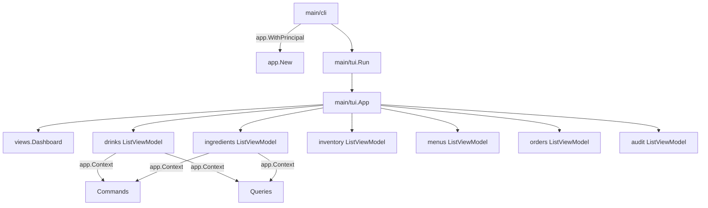

# TUI Package

Bubble Tea-based terminal UI for Mixology.

## Architecture

## Key Concepts

### App
- Root Bubble Tea model (`main/tui/app.go`).
- Always starts on the dashboard.
- Owns navigation, view caching, and global UI state (help, status, title bar).
- Uses `app.App` as the single source of truth for authentication.

### ViewModels
- One per domain view (drinks, ingredients, inventory, menus, orders, audit).
- Import styles and keys from `main/tui/styles` and `main/tui/keys`.
- Use `app.Context()` to obtain a fresh `middleware.Context` per command/query.

### Fresh Context Pattern
- Each operation uses a new context to avoid attribute leakage across actions.
- Matches CLI semantics and keeps log fields scoped to a single action.

### Title Bar + Status Bar
- Title bar shows the current view (for example: "Mixology > Dashboard").
- Status bar shows errors or a short help hint.

## File Organization

- `main/tui/app.go`: Root model, navigation, title/status bars, layout.
- `main/tui/main.go`: Entry point (`Run`).
- `main/tui/views/dashboard.go`: Dashboard view model.
- `app/domains/*/surfaces/tui/`: Domain list/detail/create/edit view models.
- `main/tui/styles/`: Shared Lip Gloss style definitions.
- `main/tui/keys/`: Shared key bindings.
- `main/tui/messages.go`: Public TUI message/view aliases.

## Adding a New View

1. Create a new view model in the target domain under `app/domains/<domain>/surfaces/tui/`.
2. Add a new `View` constant in `main/tui/views/messages.go` and `main/tui/messages.go`.
3. Wire the view into `main/tui/app.go` `currentViewModel()` and navigation.
4. Use shared styles/keys from `main/tui/styles` and `main/tui/keys`.
5. For data access, call `app.Context()` per operation.

## Notes

- The dashboard is reloaded on refresh (`r`) and when returning to it.
- Keep view models small and focused; delegate domain logic to commands/queries.
