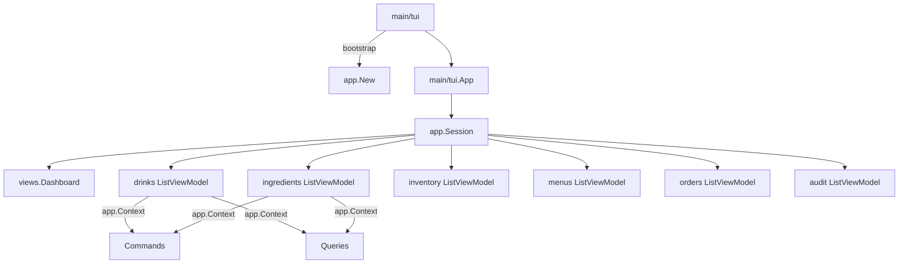

# TUI entrypoint

`main/tui` composes Mixology's Bubble Tea executable. Reusable terminal mechanics are documented in
the [TUI toolkit](../../pkg/toolkits/tui/readme.md); domain-owned view models live under
`app/domains/*/surfaces/tui`, and Mixology route identity stays in `main/tui/routes`.

## Architecture

```mermaid
graph TD
    Entry[main/tui] -->|bootstrap| AppInit[app.New]
    Entry --> TUI[main/tui.App]
    TUI --> App[app.Session]
    App --> Dash[views.Dashboard]
    App --> Drinks[drinks ListViewModel]
    App --> Ingredients[ingredients ListViewModel]
    App --> Inventory[inventory ListViewModel]
    App --> Menus[menus ListViewModel]
    App --> Orders[orders ListViewModel]
    App --> Audit[audit ListViewModel]

    Drinks -->|app.Context| Cmds[Commands]
    Drinks -->|app.Context| Qrys[Queries]
    Ingredients -->|app.Context| Cmds
    Ingredients -->|app.Context| Qrys
```

## Key Concepts

### App

- Root Bubble Tea model (`main/tui/app.go`).
- Always starts on the dashboard.
- Owns navigation, view caching, and global UI state (help, status, title bar).
- Uses `app.App` as the single source of truth for authentication.

### ViewModels

- One per domain view (drinks, ingredients, inventory, menus, orders, audit).
- Import shared styles and keys from `pkg/toolkits/tui/styles` and `pkg/toolkits/tui/keys`.
- Use `app.Context()` to obtain a fresh `middleware.Context` per command/query.
- Own domain-specific workflow state and adapt typed domain values for display.
- Report input ownership through `Interaction` so the root can route global keys.

### Shared UI mechanics

- `pkg/toolkits/tui` owns reusable terminal mechanics and presentation adapters.
- Forms and dialogs own their local input behavior.
- Domain views choose commands and render domain-specific details; shared helpers
  handle recurring concerns such as list layout, loading, filtering, and sizing.
- Extract shared behavior only after it has proven useful in multiple views.

### Interaction model

- Use `↑` and `↓` (or `k` and `j`) to select list rows and form fields.
- Press `e` to edit the selected value. `Enter` accepts that value and `Esc`
  restores it.
- `Ctrl+S` saves the enclosing create/edit workflow; `Esc` outside an active
  value edit leaves the workflow.
- Drink recipes use `↑`/`↓` to move through recipe fields and `←`/`→` to move
  through ingredient choices. `Enter` selects, toggles, adds, or removes.
- `Tab` and `Shift+Tab` remain compatibility aliases for next/previous field,
  but are not the primary navigation model.

### Fresh Context Pattern

- Each operation uses a new context to avoid attribute leakage across actions.
- Matches CLI semantics and keeps log fields scoped to a single action.

### Title Bar + Status Bar

- Title bar shows the current view (for example: "Mixology > Dashboard").
- Status bar shows errors or a short help hint.

## File Organization

- `main/tui/main.go`: Executable bootstrap and Bubble Tea launch.
- `main/tui/app.go`: Root model, navigation, title/status bars, layout.
- `main/tui/views/dashboard.go`: Dashboard view model.
- `app/domains/*/surfaces/tui/`: Domain list/detail/create/edit view models.
- `main/tui/routes/`: Mixology navigation identities and messages.

## Adding a New View

1. Create a new view model in the target domain under `app/domains/<domain>/surfaces/tui/`.
2. Add a new `View` constant in `main/tui/routes/routes.go` and use it from the shell.
3. Wire the view into `main/tui/app.go` `currentViewModel()` and navigation.
4. Use shared styles/keys from `pkg/toolkits/tui/styles` and `pkg/toolkits/tui/keys`.
5. For data access, call `app.Context()` per operation.

## Notes

- The dashboard is reloaded on refresh (`r`) and when returning to it.
- Keep view models small and focused; delegate domain logic to commands/queries.
